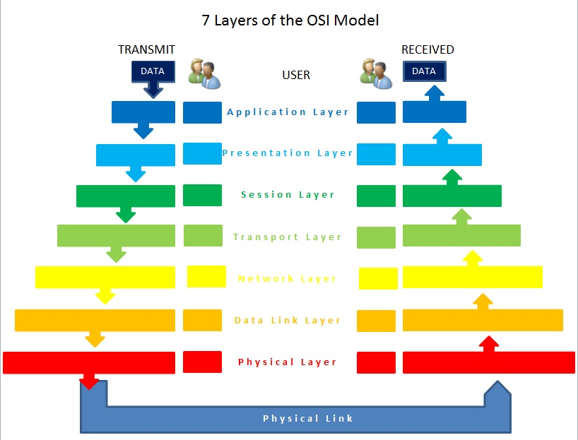

OSI Model
=========

Before we even start with nmap, we need to gain an understanding about how
computers talk to each other. Once we have an understanding, we can then use
these rules to discover other computers on our network and the services they
provide. Communication between computers on the Internet or local networks is
directed by the OSI Model.

This section will mainly refer to physical ethernet networks, and only mention
wireless in that it's effectively just a different physical layer.

Messages from one application on one system, navigate down the OSI model, being
encapsulated or encoded, until they reach the physical layer, then they are
decoded, dencapsulated, and presented to the application on the other system.

7 Application
-------------
High-level APIs, including resource sharing, remote file access.

Firefox, ssh operates at this level.

6 Presentation
--------------
Translation of data between a networking service and an application.

SSL (Secure Socket Layer) happens at this layer.

5 Session
---------
Managing communication sessions.

Sockets exist here, but are basically managed by the Operating System.

4 Transport
-----------
Reliable transmission of data segments between points on a network.

TCP (Transmission Control Protocol) and UDP (User Datagram Protocol) operate at
this level. TCP and UDP use *ports*.

3 Network
---------
Addressing, Routing, and Traffic Control.

IP (Internet Protocol) and ICMP (Internet Control Message Protocol) operate at
this level.

2 Data Link
-----------
Reliable transmission of data frames between two nodes connected by a physical
layer.

PPP (from dial-up days) happens here. MAC (Media Access Control) and ARP
(Address Resolution Protocol) also operate at this layer.

1 Physical
----------
Transmission and reception of raw bit streams over a physical medium

This is the physical cable itself.

Usage
-----

- Applications like web browsers and ssh, only really use layer 7, but they're
concerned with layers 3-7.
- Typical home routers perform many functions. In enterprise environments, this
are usually all separate physical systems or virtual machines, and at times,
multiple systems serving the same function.
  - Network Router
  - Firewall
  - DHCP Server
  - Name Server
- Network Routers only care about layer 2 or 3 depending on grade.
- Firewalls only care about layers 3 and 4.
- DHCP Servers are just applications, running at layer 7.
- Name Servers are also applications, running at layer 7.

Sources
-------
- https://en.wikipedia.org/wiki/OSI_model
