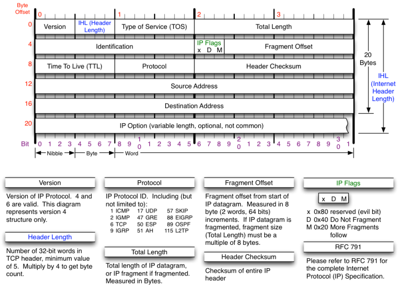

Client To Server Communication
==============================

Packet Header Diagrams
----------------------

As mentioned in the [OSI Model](1-osi-model.md), data is encapsulated in
different formats. Here are the headers of a TCP/IP packet and a ICMP packet.

### IP Packet Header

[](https://nmap.org/book/tcpip-ref.html)

### TCP Packet Header

[](https://nmap.org/book/tcpip-ref.html)

### ICMP Packet Header
[](https://nmap.org/book/tcpip-ref.html)

What Happens When…
------------------

_Much more indepth answer at: https://github.com/alex/what-happens-when_
Let's start with a classic interview question: What happens when you type in
'google.com' in your browser and press the enter key.

### Name Resolution

When your computer joined the network, it most likely used a protocol called
DHCP (Dynamic Host Configuration Protocol) to ask some machine on the network,
typically a router, for connection information. Typically this includes:

- IP Address lease
- Address of default gateway
- Address of name server

The computer joining the network broadcasts a UDP packet, using the DHCP
format, with its hostname, and MAC address.

Your browser asked your operating system to resolve 'google.com' for you and
return an IP Address. The operating system asked the name servers it learned
about from the DHCP packet for the address of the domain.

### Connect to IP Address

Your browser now knows which machine on the internet to try to reach. However,
in most cases, your computer isn't on the same network as 'google.com', so your
computer formats the IP packet with the MAC address of the default gateway and
inserts it onto the network. The gateway picks up this packet, remembers who
sent it, changes the destination MAC to its gateway's MAC, changes the source
MAC to its external MAC, and passes it on. Since this is a TCP packet, your
operating system, your router, all of the routers in between you and Google's
servers, and Google's webserver have to agree that a session has been
established.

There's a handshake that happens, to establish a socket. Your system sends a
SYN packet, a TCP packet with the SYN flag set, to Google's servers. Google
responds with a matching TCP packet, but with the ACK flag set as well. Your
system then sends a matching packet with just the ACK flag back and a session
is established. The remainder of the packets in this session only have the ACK
flag set. When either side is ready to close the session, a packet with the FIN
flag set is sent. It is ACKed, then the final ACK packet is sent in reply.

[](http://www.masterraghu.com/subjects/np/introduction/unix_network_programming_v1.3/ch02lev1sec6.html)

### HTTP Request

Now that the browser has a socket opened, a stream of packets representing the
HTTP Request and response flow between the two applications, the web browser
and the web server.

The browser sends a series of one or more packets that resembles:
```
GET / HTTP/1.1
Host: google.com
User-Agent: Firefox/Chrome
```

…and the webserver responds with one or more packets that resembles:
```
HTTP 200 OK
Server: Google Server
Content-Type: text/html
Content-Length: 123lots

<html>…
```
