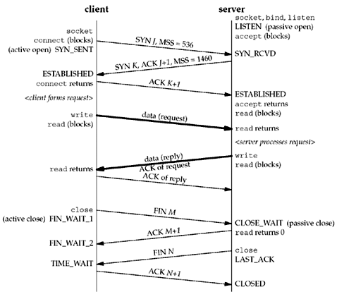

TCP and ICMP
============

Packet Header Diagrams
----------------------

The two types of IP packets discussed in this section are TCP and ICMP.

### TCP Packet Header

[](https://nmap.org/book/tcpip-ref.html)

### ICMP Packet Header
[](https://nmap.org/book/tcpip-ref.html)

TCP Handshake
-------------

There's a handshake that happens to establish a socket. Your system sends a
SYN packet, a TCP packet with the SYN flag set, to Google's servers. Google
responds with a matching TCP packet, but with the ACK flag set as well. Your
system then sends a matching packet with just the ACK flag back and a session
is established. The remainder of the packets in this session only have the ACK
flag set. When either side is ready to close the session, a packet with the FIN
flag set is sent. It is ACKed, then the final ACK packet is sent in reply.

[](http://www.masterraghu.com/subjects/np/introduction/unix_network_programming_v1.3/ch02lev1sec6.html)

What happens when there isn't a server listening on that TCP port? The remote
computer replies to the SYN packet with a packet with only RST flags set.

How do you determine which systems are even available on a network?

ICMP Protocol
-------------

In the same layer as IP, there exists ICMP. Sometimes, when you send TCP
packets to systems that are blocked, you'll get an ICMP packet back instead.
This protocol is used in kind of a management fashion, instead of transport
fashion like TCP and UDP. ICMP packets contain answers to questions like:
Is this system reachable? Is this route valid?

An application that's on every system for asking of systems are reachable:
`ping`

Try it now with google.com:
```
ping google.com
```

If ping doesn't stop after a few packets, hold down Control and press c once to
interrupt it.

Ping also asks the system to resolve a domain name, then ping sends ICMP
packets of type 8 Echo. Google is sending you response packets of type 0 Echo
Reply.

